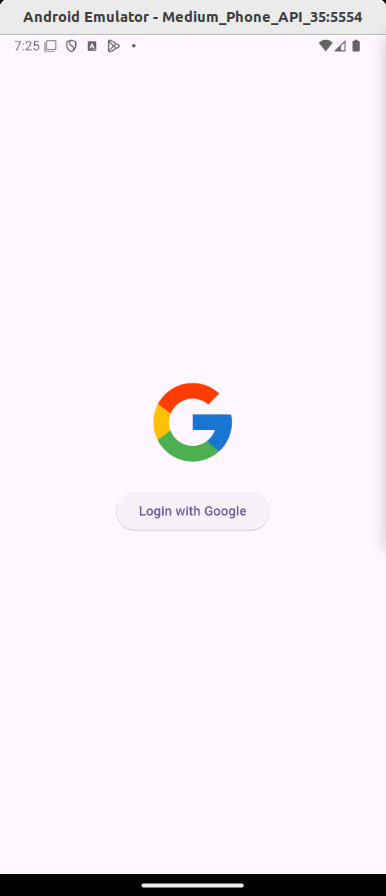
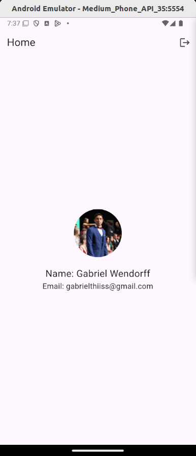

# Flutter Login

Um projeto Flutter desenvolvido por Gabriel Wendorff e Vinicius Fernandes Carvalho, alunos do 4º semestre de Engenharia de Software da Católica SC.

O projeto **Flutter Login** é um aplicativo desenvolvido seguindo a premissa feita para a N3 da matéria de Desenvolvimento Mobile.

## Escopo

**App de Login com autenticação**

- **Objetivo**: Permitir que o usuário se logue no aplicativo através do autenticador do Google, acesse a tela principal com suas informações pessoais e tenha a opção de se deslogar.

## Telas do Projeto

| Tela Inicial                  | Tela Home                 |
|-------------------------------|---------------------------|
|  |  |

## Funções por Tela

### Tela Inicial:
- Botão de autenticação com o Google.
- Redirecionamento para a tela **Home** após login bem-sucedido.

### Tela Home:
- Exibição de informações do usuário logado (nome, email, etc.).
- Botão para logout do aplicativo.

## Tipos de Erros do Provedor Escolhido

- **Erro de autenticação cancelada**: O usuário cancelou o login antes de completá-lo.
- **Erro de credenciais inválidas**: As credenciais do Google não foram aceitas.
- **Erro de conexão**: Problemas de conectividade ao tentar autenticar com o servidor do Google.
- **Erro desconhecido**: Um erro inesperado ocorreu.

## Dependências Utilizadas

- **Flutter**: 3.5.3
- **Dart**: 3.5.3
- **google_sign_in**: 6.0.1
- **firebase_core**: 3.8.1
- **firebase_auth**: 5.3.4
- **cloud_firestore**: 5.5.1
- **provider**: 6.1.2
- **cupertino_icons**: 1.0.8

## Instruções para Configuração/Importação

### Requisitos:
- **Flutter SDK**: Versão 3.5.3 ou superior.
- **Dart**: Versão 3.5.3.
- Versão mínima do SDK para executar: 3.5.3.
- Um dispositivo Android/iOS ou emulador configurado.

### Passo a Passo:

1. Clone o repositório:
   ```bash
   git clone https://github.com/usuario/repositorio.git
   ```

2. Navegue até a pasta do projeto:
   ```bash
   cd repositorio
   ```

3. Instale as dependências:
   ```bash
   flutter pub get
   ```

4. Configure os arquivos do Firebase:
   - Adicione o arquivo `google-services.json` (Android) em `android/app`.
   - Adicione o arquivo `GoogleService-Info.plist` (iOS) em `ios/Runner`.

5. Execute o projeto:
   ```bash
   flutter run
   ```

6. Caso utilize emuladores, certifique-se de que estejam devidamente configurados antes de rodar o comando.
